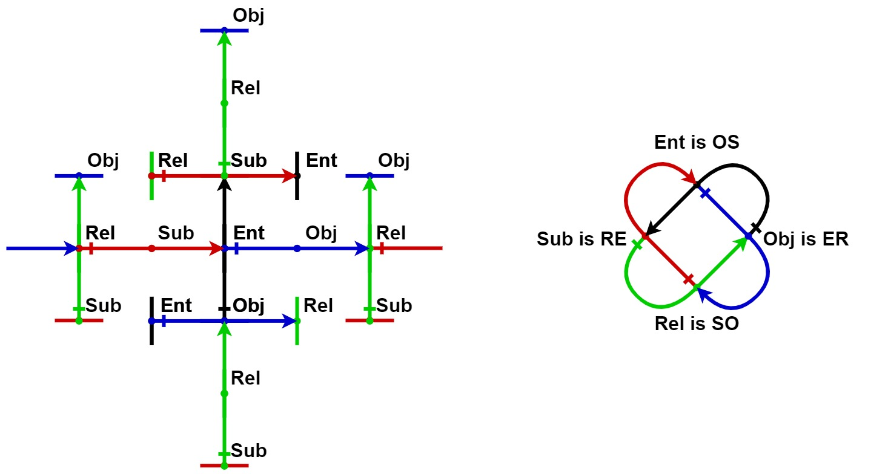

<p align="center"></p>

# AVM - Associative Virtual Machine

[English](#english) | [Русский](#russian)

---

<a name="english"></a>
## English

### Description

AVM (Associative Virtual Machine) is a project implementing a virtual machine based on the **Associative Relations Model (ARM)**. The project provides tools for working with ARM, including data representation, JSON serialization/deserialization, and logical operations.

```
      Associative Virtual Machine

                  E
                  ^
                  |
                  E
                  |
                  +
           E+-----R----->E

```

### Core Concepts

The Associative Relations Model (ARM) is a mathematical model for storing and processing information based on:

- **Associations** — ordered pairs of elements (tuples of length 2)
- **Entities (E)** — interpretation of associations as correspondence (R, E)
- **Relations (R)** — interpretation of associations as mapping (E, E)
- Two root associations define the base structure:
  - `Rel = (Ent, Ent)` — set of relations
  - `Ent = (Rel, Ent)` — set of entities

### Features

- Implementation of a virtual machine for executing ARM-based code
- Support for structured data (arrays and associative arrays)
- JSON serialization/deserialization (null, boolean, array, number, string, object)
- Logical operations (NOT, AND, OR) defined as truth tables in entity maps
- Standard library of logical operations (XOR, NAND, NOR, Implies, Eq) as truth tables
- Conditional construct `If` with lazy evaluation of then/else branches
- Recursive functions via `Def`/`Call` with named parameters and recursion depth protection
- Relative addressing operator `[]` for evaluating functions via `eval()`
- Multi-dimensional relative addressing for passing arguments
- Expression interpreter `interpret()` for evaluating logical, conditional and recursive expressions from JSON
- Sequential expression execution via JSON arrays for function definition and invocation

### Current Status

**Version: 0.0.6** (Alpha)

Implemented:
- JSON null, boolean, array, number (unsigned, integer, float), string, object serialization/deserialization
- Base vocabulary initialization (R, E, True, False, Unsigned, Integer, Float, String, Object, Not, And, Or, If, Def, Call, Xor, Nand, Nor, Implies, Eq)
- Logical operations NOT, AND, OR with truth tables via entity map
- Standard library: XOR, NAND, NOR, Implies (a → b), Eq (a ↔ b) with truth tables via entity map
- Conditional construct If with lazy evaluation (e.g. `{"If": [true, "yes", "no"]}` → `"yes"`)
- Recursive functions via Def/Call (e.g. `[{"Def": ["f", ["x"], body]}, {"Call": ["f", arg]}]`)
- Relative addressing operator `[]` via `eval()` function for computing logical functions
- Expression interpreter for evaluating logical, conditional and recursive expressions from JSON
- 240 unit tests + 16 JSON roundtrip tests
- CI/CD pipeline (GitHub Actions) for Linux, macOS, Windows

In Progress:
- Persistent storage integration with LinksPlatform
- CRUD API for programmatic use

### Documentation

- [JSON Serialization Algorithm (serialization.md)](serialization.md) — detailed description of JSON ↔ ARM conversion
- [Project Analysis (analysis.md)](analysis.md) — detailed analysis of strengths and weaknesses
- [Development Plan (plan.md)](plan.md) — roadmap and future directions

### Installation

Clone the repository:
```bash
git clone https://github.com/netkeep80/avm.git
cd avm
```

Create build directory:
```bash
mkdir build && cd build
```

Generate build files with CMake:
```bash
cmake ..
```

Build the project:
```bash
cmake --build .
```

### Usage

```bash
./avm [entry_point.json]
```

The application reads a JSON file, converts it to ARM representation, and saves the result to `res.json`.

If the input JSON is a logical expression (e.g. `{"Not": [true]}`), the expression interpreter evaluates it and saves the result:
```bash
echo '{"Not": [{"And": [true, false]}]}' > expr.json
./avm expr.json
cat res.json  # true
```

Conditional expressions with lazy evaluation:
```bash
echo '{"If": [true, true, false]}' > cond.json
./avm cond.json
cat res.json  # true
```

Recursive functions with Def/Call:
```bash
echo '[{"Def": ["myNot", ["x"], {"Not": ["x"]}]}, {"Call": ["myNot", true]}]' > rec.json
./avm rec.json
cat res.json  # false
```

Standard library operations (XOR, NAND, NOR, Implies, Eq):
```bash
echo '{"Xor": [true, false]}' > xor.json
./avm xor.json
cat res.json  # true

echo '{"Implies": [true, false]}' > imp.json
./avm imp.json
cat res.json  # false

echo '{"Eq": [true, true]}' > eq.json
./avm eq.json
cat res.json  # true
```

### Dependencies

- C++20 compatible compiler
- CMake 3.20+
- [nlohmann/json](https://github.com/nlohmann/json) — JSON library for Modern C++
- [LinksPlatform](https://github.com/linksplatform) — associative data storage (optional)

---

<a name="russian"></a>
## Русский

### Описание

AVM (Associative Virtual Machine) — проект, реализующий виртуальную машину на основе **Модели Ассоциативных Отношений (МАО)**. Проект предоставляет инструменты для работы с МАО, включая представление данных, сериализацию/десериализацию JSON и логические операции.

```
      Ассоциативная Виртуальная Машина

                  E
                  ^
                  |
                  E
                  |
                  +
           E+-----R----->E

```

### Основные концепции

Модель Ассоциативных Отношений (МАО) — математическая модель для хранения и обработки информации, основанная на:

- **Ассоциации** — упорядоченные пары элементов (кортежи длины 2)
- **Сущности (E)** — интерпретация ассоциаций как соответствие (R, E)
- **Отношения (R)** — интерпретация ассоциаций как отображение (E, E)
- Две корневые ассоциации определяют базовую структуру:
  - `Rel = (Ent, Ent)` — множество отношений
  - `Ent = (Rel, Ent)` — множество сущностей

### Возможности

- Реализация виртуальной машины для исполнения кода на основе МАО
- Поддержка структурированных данных (массивы и ассоциативные массивы)
- Сериализация/десериализация JSON (null, boolean, array, number, string, object)
- Логические операции (NOT, AND, OR), определённые как таблицы истинности в entity map
- Стандартная библиотека логических операций (XOR, NAND, NOR, Implies, Eq) как таблицы истинности
- Условная конструкция `If` с ленивым вычислением веток then/else
- Рекурсивные функции через `Def`/`Call` с именованными параметрами и защитой от бесконечной рекурсии
- Оператор относительной адресации `[]` для вычисления функций через `eval()`
- Многомерная относительная адресация для передачи аргументов
- Интерпретатор выражений `interpret()` для вычисления логических, условных и рекурсивных выражений из JSON
- Последовательное выполнение выражений через JSON-массивы для определения и вызова функций

### Текущее состояние

**Версия: 0.0.6** (Альфа)

Реализовано:
- Сериализация/десериализация JSON null, boolean, array, number (unsigned, integer, float), string, object
- Инициализация базового словаря (R, E, True, False, Unsigned, Integer, Float, String, Object, Not, And, Or, If, Def, Call, Xor, Nand, Nor, Implies, Eq)
- Логические операции NOT, AND, OR с таблицами истинности через entity map
- Стандартная библиотека: XOR, NAND, NOR, Implies (a → b), Eq (a ↔ b) с таблицами истинности
- Условная конструкция If с ленивым вычислением (например `{"If": [true, "да", "нет"]}` → `"да"`)
- Рекурсивные функции через Def/Call (например `[{"Def": ["f", ["x"], тело]}, {"Call": ["f", арг]}]`)
- Оператор относительной адресации `[]` через функцию `eval()` для вычисления логических функций
- Интерпретатор выражений для вычисления логических, условных и рекурсивных выражений из JSON
- 240 модульных тестов + 16 JSON roundtrip тестов
- CI/CD пайплайн (GitHub Actions) для Linux, macOS, Windows

В разработке:
- Персистентное хранение — интеграция с LinksPlatform
- CRUD API для программного использования

### Документация

- [Алгоритм сериализации JSON (serialization.md)](serialization.md) — подробное описание преобразования JSON ↔ МАО
- [Анализ проекта (analysis.md)](analysis.md) — подробный анализ сильных и слабых сторон
- [План развития (plan.md)](plan.md) — дорожная карта и направления развития

### Установка

Клонируйте репозиторий:
```bash
git clone https://github.com/netkeep80/avm.git
cd avm
```

Создайте директорию сборки:
```bash
mkdir build && cd build
```

Сгенерируйте файлы сборки с помощью CMake:
```bash
cmake ..
```

Скомпилируйте проект:
```bash
cmake --build .
```

### Использование

```bash
./avm [entry_point.json]
```

Приложение читает JSON файл, преобразует его в представление МАО и сохраняет результат в `res.json`.

Если входной JSON является логическим выражением (например `{"Not": [true]}`), интерпретатор вычисляет его и сохраняет результат:
```bash
echo '{"Not": [{"And": [true, false]}]}' > expr.json
./avm expr.json
cat res.json  # true
```

Условные выражения с ленивым вычислением:
```bash
echo '{"If": [true, true, false]}' > cond.json
./avm cond.json
cat res.json  # true
```

Рекурсивные функции через Def/Call:
```bash
echo '[{"Def": ["myNot", ["x"], {"Not": ["x"]}]}, {"Call": ["myNot", true]}]' > rec.json
./avm rec.json
cat res.json  # false
```

Операции стандартной библиотеки (XOR, NAND, NOR, Implies, Eq):
```bash
echo '{"Xor": [true, false]}' > xor.json
./avm xor.json
cat res.json  # true

echo '{"Implies": [true, false]}' > imp.json
./avm imp.json
cat res.json  # false

echo '{"Eq": [true, true]}' > eq.json
./avm eq.json
cat res.json  # true
```

### Зависимости

- Компилятор с поддержкой C++20
- CMake 3.20+
- [nlohmann/json](https://github.com/nlohmann/json) — JSON библиотека для C++
- [LinksPlatform](https://github.com/linksplatform) — ассоциативное хранилище данных (опционально)

---

## License / Лицензия


[MIT License](https://opensource.org/licenses/MIT)

Copyright &copy; 2022 [Vertushkin Roman Pavlovich](https://vk.com/earthbirthbook)

Permission is hereby granted, free of charge, to any person obtaining a copy of this software and associated documentation files (the "Software"), to deal in the Software without restriction, including without limitation the rights to use, copy, modify, merge, publish, distribute, sublicense, and/or sell copies of the Software, and to permit persons to whom the Software is furnished to do so, subject to the following conditions:

The above copyright notice and this permission notice shall be included in all copies or substantial portions of the Software.

THE SOFTWARE IS PROVIDED "AS IS", WITHOUT WARRANTY OF ANY KIND, EXPRESS OR IMPLIED, INCLUDING BUT NOT LIMITED TO THE WARRANTIES OF MERCHANTABILITY, FITNESS FOR A PARTICULAR PURPOSE AND NONINFRINGEMENT. IN NO EVENT SHALL THE AUTHORS OR COPYRIGHT HOLDERS BE LIABLE FOR ANY CLAIM, DAMAGES OR OTHER LIABILITY, WHETHER IN AN ACTION OF CONTRACT, TORT OR OTHERWISE, ARISING FROM, OUT OF OR IN CONNECTION WITH THE SOFTWARE OR THE USE OR OTHER DEALINGS IN THE SOFTWARE.

---

## Thanks / Благодарности

- [Vladimir Muravyev](https://github.com/vmuravyev) — helped develop the terminological apparatus of the Relations Model / помог в разработке терминологического аппарата Модели Отношений

## Used third-party tools / Используемые сторонние инструменты

- [**JSON for Modern C++**](https://github.com/nlohmann/json) — for load/unload JSON view of Relations Model / для загрузки/выгрузки JSON представления Модели Отношений
- [**LinksPlatform**](https://github.com/linksplatform) — for storing associative model / для хранения ассоциативной модели
- [**ChatGPT 4.0**](https://chat.openai.com/chat) — for documentation generation / для генерации документации

---

## Contact / Контакты

- Email: netkeep80@gmail.com
- GitHub: [netkeep80/avm](https://github.com/netkeep80/avm)
