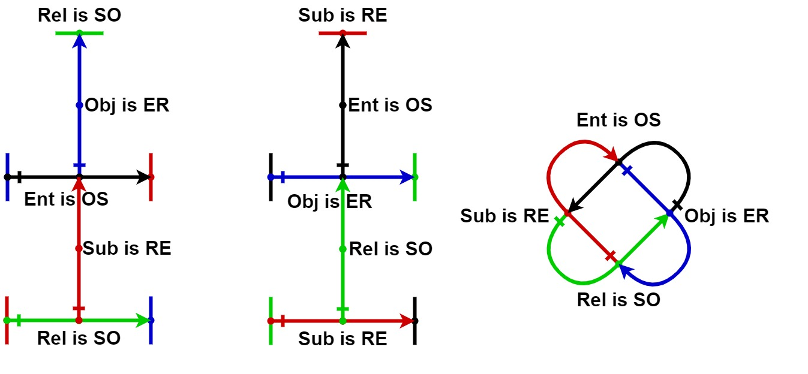

<p align="center"></p>

# AVM — ассоциативная виртуальная машина

AVM — экспериментальная виртуальная машина на C++20, построенная поверх Модели Отношений и канонического хранилища направленных связей.

**Текущая публичная версия: 1.3.0.** Архитектурное развитие репозитория прошло этапы AVM 1.0–1.4; AVM 1.5 собирает доказанный перенос выбранной семантики `jsonRVM` в единый link-native runtime без legacy fallback.

## Главная идея

AVM использует один производственный семантический путь:

```text
внешнее представление
  -> проекция / адаптер
  -> канонический LinkStore
  -> кодек Модели Отношений
  -> программа как LinkId
  -> BootstrapRuntime / Executor
  -> LinkId результата
```

JSON является внешней проекцией и протоколом совместимости. Грамматика Anum/МТС и контекстная денотация остаются канонически определёнными в `netkeep80/anum_docs`; AVM принимает только структурный, независимый от физического хранилища результат проекции. Ни JSON, ни Anum не являются внутренним AST виртуальной машины.

Физический примитив AVM — канонический направленный дуплет:

```text
LinkId -> (begin: LinkId, end: LinkId)
```

`LinkId` — непрозрачная идентичность. Операции чтения не материализуют отсутствующие связи, а `intern(a,b)` возвращает канонический `LinkId` точной пары в пределах одного логического хранилища.

## Модель Отношений поверх дуплетов

Триединая сущность Модели Отношений имеет роли:

```text
(relation, subject, object)
```

В AVM используется один канонический порядок вложения:

```text
subject_object = Link(subject, object)
entity         = Link(relation, subject_object)
```

то есть:

```text
(relation, subject, object)
= (relation, (subject, object))
```

Такое представление сохраняет все три роли без отдельного физического типа «триплет».

## AVM 1.0 — архитектурный фундамент завершён

AVM 1.0 сформировал и проверил:

- `LinkStore` как единый контракт хранения, с эталонными in-memory и persistent реализациями;
- каноническое представление `(relation, subject, object) = (relation, (subject, object))`;
- явные идентичности bootstrap-словаря;
- link-native исполнение через `BootstrapRuntime` и `Executor`;
- программы, функции, bindings и call frames как связи;
- независимую от parser/grammar границу внешних проекций;
- структурный мост Anum L3→L4 без дублирования грамматики МТС внутри AVM;
- отдельные адаптеры JSON-значений и JSON-программ;
- сохранение идентичности после закрытия и повторного открытия persistent backend;
- проверку установленного пакета на Linux, Windows и macOS;
- warnings-as-errors, ASan/UBSan, архитектурные CI-guards и benchmark baselines.

Исторические pointer-based `rel_t`, JSON semantic interpreter и временный protocol-only Anum bridge удалены после миграции потребителей. История остаётся в Git; в рабочей архитектуре существует один семантический путь.

## AVM 1.1 — ассоциативные запросы только для чтения завершены

AVM 1.1 добавил независимый от backend слой запросов к Модели Отношений:

```cpp
avm::RelationQuery query{
    .relation = relation,
    .subject = std::nullopt,
    .object = object,
};

const auto matches = avm::query_relation_entities(store, query);
```

Хотя бы одно из полей `relation/subject/object` должно быть ограничено. Запросы используют только существующие операции `LinkStore`: `find`, `outgoing`, `incoming`, `get`, `contains`. Они не вызывают `intern` и `create_point` и не создают второй мир индексов.

Запросы структурны, а не registry-based. AVM не хранит скрытый список связей, которые «были созданы как сущности». Более узкие домены должны задаваться самими связями и отношениями.

Измерения fan-out 1/8/64/256 показали ожидаемый рост стоимости расширения кандидатов, но не дали оснований добавлять дополнительный persistent physical index без реального workload/SLA.

См. [контракт запросов Модели Отношений](docs/relations-query.md).

## AVM 1.2 — структурная стандартная библиотека завершена

AVM 1.2 сделал структуру дуплетов непосредственно доступной link-native программам.

Минимальное нативное ядро:

```text
link_begin(expr)       -> begin-полюс
link_end(expr)         -> end-полюс
identity_equal(a,b)    -> каноническое Boolean-значение
link_exists(a,b)       -> каноническое Boolean-значение, только наблюдение
pair_intern(a,b)       -> канонический LinkId(a,b), явный эффект
```

`link_exists` не использует `nil` как признак отсутствия, потому что `nil` сам является допустимой self-link. `pair_intern` — явная граница материализации и идемпотентен благодаря `LinkStore::intern`.

Операции, выражаемые через это ядро, реализуются обычными функциями AVM, а не новыми C++ handlers. Например:

```text
is_self_link(x) = identity_equal(link_begin(x), link_end(x))
```

См. [структурную стандартную библиотеку](docs/structural-standard-library.md).

## AVM 1.3 — наблюдаемость исполнения завершена

AVM 1.3 добавил детерминированное наблюдение к существующему `Executor::execute` без возможности управлять исполнением.

`ExecutionEvent` содержит только канонические данные AVM:

```text
Enter(ExecutionContext)
Return(ExecutionContext, result LinkId)
Fail(ExecutionContext, phase)
```

Для отказов используется конечная классификация фаз:

```text
Dispatch
Handler
ResultValidation
```

Наблюдатель не может заменить handler, пропустить исполнение или подменить результат. Его исключения изолированы от программы. Наблюдение не материализует связи.

`BoundedExecutionTrace` хранит ограниченный префикс событий в памяти host-среды и явно сообщает о truncation.

Для одного и того же `PersistentLinkStore` после reopen требуется точное совпадение LinkId-based traces. Для независимо построенных backends сравнение выполняется с точностью до биективного переименования непрозрачных `LinkId`.

CLI использует тот же executor:

```text
avm program.json
avm --trace program.json
avm --trace-limit 64 program.json
```

См. [контракт наблюдаемости исполнения](docs/execution-observability.md).

## AVM 1.4 — инспекция и диагностический tooling завершены

AVM 1.4 построил слой инспекции поверх существующих публичных API, не создавая второго executor или отдельной семантики.

`InspectionSession` объединяет:

- наблюдение связей и сущностей;
- запросы Модели Отношений;
- запуск через существующий `BootstrapRuntime`;
- сбор `BoundedExecutionTrace`;
- persistent reopen scenarios.

Текстовые inspection-команды являются только интерфейсом tooling: после parsing они превращаются в типизированные команды и используют тот же runtime.

См. [сессию инспекции](docs/inspection-session.md), [команды инспекции](docs/inspection-commands.md) и [persistent inspection session](docs/persistent-inspection-session.md).

## AVM 1.5 — доказанный перенос семантики Relations Model из jsonRVM

AVM 1.5 отвечает на более сильный вопрос: может ли AVM исполнять существенную семантику старого `jsonRVM` через один canonical link-native runtime, не возвращая JSON interpreter?

Representation problem уже решён:

```text
(relation, subject, object) = Link(relation, Link(subject, object))
```

Execution semantics переносилась evidence-driven gates. Pinned historical oracle:

```text
netkeep80/jsonRVM@843b3326141e090ccd1a106ba0a4a21ce72805b7
runtime 3.0.0
```

Доказанный frozen corpus:

```text
CASE-ARITHMETIC                  -> 2
CASE-SEQUENCE-ORDER              -> 3
CASE-PURE-RELATION-COMPOSITION   -> 5
CASE-FOREACH-CONTEXT             -> [1,2,3]
CASE-BOOLEAN-BRANCH              -> 42
CASE-MISSING-REFERENCE           -> typed source failure
```

Контексты `ent/rel/sub/obj`, current/parent references, ordered sequence, explicit relation-state transitions, foreach child contexts, lazy control и canonical values реализованы как link-native contracts. Pure result не означает скрытое `$rel := result`: semantic state меняется только через явный `ExecutionOutcome`.

Для отсутствующей textual reference точная compatibility boundary доказана только для frozen marker `__avm_missing_reference_oracle__`, который даёт `MigrationFailureKind::UnresolvedReference`. Произвольный неподтверждённый `$ref` остаётся `InvalidSource` / unsupported; synthetic LinkId не создаётся.

Native JSON и canonical Anum L3 сходятся к одной `ProjectionDescription -> find | realize -> LinkStore` semantics. Versioned `frontend-common-denotation/v1` доказывает в том числе shared-substructure convergence и исполнение общего `quote` root одним обычным `Executor` независимо от frontend provenance.

Финальный persistent release proof использует context-sensitive program `1+1; $rel+3 -> 5`: canonical root materialize-ится один раз, затем тот же `PersistentLinkStore` открывается заново и existing root исполняется с сохранёнными vocabulary identities **без legacy JSON, remigration, reprojection и повторного realize**.

Host effects не входят в proven pure AVM 1.5 subset. До переноса первого filesystem/HTTP/time/database/native effect обязателен отдельный capability gate #129.

См. [совместимость jsonRVM и AVM](docs/jsonrvm-compatibility.md), [semantic migrator](docs/jsonrvm-semantic-migrator.md) и [доказательства готовности AVM 1.5](docs/avm-1.5-release-proof.md).

## Публичный API ядра

Независимый от JSON C++ API доступен через:

```cpp
#include <avm/avm.h>
```

Минимальный пример link-native исполнения:

```cpp
#include <avm/avm.h>

int main()
{
    avm::InMemoryLinkStore store;
    avm::BootstrapRuntime runtime(store);
    avm::ProgramBuilder builder = runtime.builder();

    const avm::LinkId expression =
        builder.logical_not(builder.literal(runtime.vocabulary().false_value));
    const avm::LinkId result = runtime.execute(expression);

    return result == runtime.vocabulary().true_value ? 0 : 1;
}
```

Umbrella-header намеренно не включает JSON adapters. JSON не является зависимостью `avm::core`.

## Установка и использование через CMake

```bash
cmake -S . -B build-install \
  -DAVM_BUILD_CLI=OFF \
  -DAVM_BUILD_CORE_TESTS=OFF \
  -DAVM_BUILD_JSON_COMPAT_TESTS=OFF \
  -DCMAKE_INSTALL_PREFIX=/path/to/prefix
cmake --install build-install
```

В consuming project:

```cmake
find_package(avm 1.3 CONFIG REQUIRED)
target_link_libraries(my_program PRIVATE avm::core)
```

`avm::core` — header-only C++20 target. Установленный interface указывает только на install prefix и не зависит от repository-relative путей или `3p`.

## Версионирование и совместимость

AVM использует Semantic Versioning для документированных публичных контрактов ядра. Версии в CMake и `include/avm/version.h` обязаны совпадать. CI отклоняет tagged build, если тег не равен `v<project-version>`.

Совместимость внутри AVM 1.x относится к документированным контрактам через `<avm/avm.h>` и `avm::core`. Внутренняя структура header-only реализации не является ABI-обещанием.

См. [политику релизов AVM 1.x](docs/release-policy.md).

## Физические backends

`InMemoryLinkStore` — эталонный backend. `PersistentLinkStore` доказывает reopen/identity semantics. Другие физические backends должны реализовывать тот же контракт `LinkStore`.

Backend не имеет права определять relations VM, query semantics, JSON rules, Anum grammar или execution semantics.

## Воспроизводимая проверка репозитория

```bash
git clone https://github.com/netkeep80/avm.git
cd avm
cmake -S . -B build -DCMAKE_BUILD_TYPE=Release
cmake --build build --parallel
ctest --test-dir build --output-on-failure
```

CI устанавливает пакет во временный prefix и собирает внешний consumer на Linux, Windows и macOS через `find_package` и `avm::core`. Полная portable matrix также выполняет conformance tests CLI и адаптеров.

## Основные документы

- [Архитектурный контракт AVM](docs/architecture.md)
- [Ядро исполнения](docs/execution-kernel.md)
- [Модель link-native программ](docs/program-model.md)
- [Функции, bindings и call frames](docs/functions-and-frames.md)
- [Структурная стандартная библиотека](docs/structural-standard-library.md)
- [Запросы Модели Отношений](docs/relations-query.md)
- [Наблюдаемость исполнения](docs/execution-observability.md)
- [Сессия инспекции](docs/inspection-session.md)
- [Контракт адаптера внешнего протокола](docs/protocol-adapter-contract.md)
- [Граница проекции](docs/projection-boundary.md)
- [Мост Anum L3→L4](docs/anum-l3-l4-bridge.md)
- [Persistent LinkStore](docs/persistent-link-store.md)
- [Совместимость jsonRVM и AVM](docs/jsonrvm-compatibility.md)
- [Semantic migrator jsonRVM → AVM](docs/jsonrvm-semantic-migrator.md)
- [Доказательства готовности AVM 1.5](docs/avm-1.5-release-proof.md)
- [Политика релизов](docs/release-policy.md)
- [Анализ проекта](analysis.md)
- [План развития](plan.md)

## Язык документации

Нормативный язык проектной документации AVM — русский. Имена публичного API, identifiers, форматы, команды, имена внешних проектов и кодовые примеры сохраняются в исходном техническом виде.

Лицензия и документация вендорного кода не переводятся как часть документации AVM.

## Зависимости

Ядро:

- компилятор C++20;
- CMake 3.20+.

Опциональная JSON boundary / CLI:

- встроенный `nlohmann/json`.

## Лицензия

MIT License. Copyright © 2022 Vertushkin Roman Pavlovich.